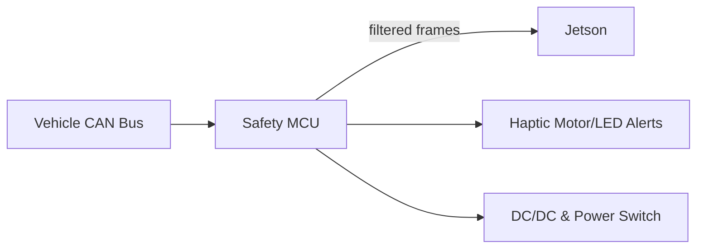

### General
- Primary CAN bus connected via STM32 (2× CAN-FD capable).
- USB-CAN adapter for development and logging.
- Jetson communicates with STM32 over UART or USB.

### Signals of Interest
| Signal        | Source | Use                         |
| ------------- | ------ | --------------------------- |
| VehicleSpeed  | ECU    | Ego-motion fusion           |
| SteeringAngle | EPS    | Lane curvature compensation |
| YawRate       | ESP    | Stability estimation        |
| TurnSignal    | BCM    | Trigger for lane change FSM |
| BrakeStatus   | ABS    | Planner gating              |
| GearPosition  | TCM    | Context for control logic   |

### Architecture

### STM32 Responsibilities

- Hardware watchdog
- Frame filtering / sanity checks
- CAN rate-limiting if any TX messages are implemented
- Health telemetry to Jetson via serial or CAN2