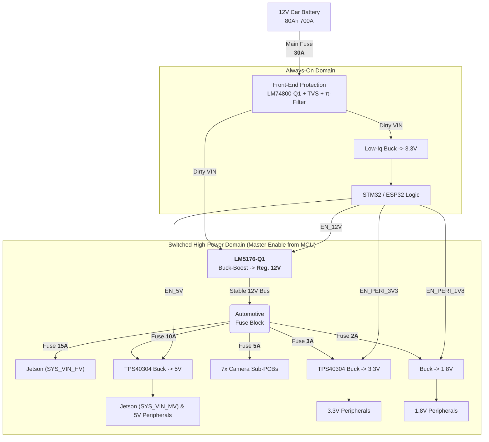

### Architecture Overview

### System Power Budget & Fusing

This table summarizes the total system power requirements. The design must account for the **worst-case input current**, which occurs at minimum battery voltage (`Vin,min`).

| Power Rail              | Max Load Current | Max Load Power | Converter Input Current from **Stable 12V Bus** | Recommended Branch Fuse |
| :---------------------- | :--------------- | :------------- | :---------------------------------------------- | :---------------------- |
| **Direct 12V**          | 5.4 A            | 64.8 W         | **5.4 A**                                       | **15 A**                |
| **5V System**           | 15 A             | 75 W           | **~6.6 A**                                      | **10 A**                |
| **3.3V Peripherals**    | 5 A              | 16.5 W         | **~1.5 A**                                      | **3 A**                 |
| **Camera System (7x)**  | 7 A (total)      | 23.1 W         | **~2.1 A**                                      | **5 A**                 |
| **1.8V Peripherals**    | 2 A              | 3.6 W          | **~0.3 A**                                      | **2 A**                 |
| **TOTAL**               | ---              | **~183 W**     | **~15.9 A** (Peak Load on Stable 12V Bus)       |                         |
| **Pre-Regulator Input** | ---              | **~201 W**     | **~18.5 A** (Peak Draw from Battery @ Vin,min)  | **Main Fuse: 30A**      |

### Jetson Rail Target (AGX Orin 32GB or 64GB)

- **Input Voltages & Amperages:** The module requires two primary power inputs, both supplied by the carrier board's regulated DC/DC converters:
  - **High-Voltage (HV) Rail (`SYS_VIN_HV`):** 7V to 20V (drawing up to **5.4 A**). This will be supplied by the switched **12 V** regulated rail.
  - **Medium-Voltage (MV) Rail (`SYS_VIN_MV`):** 4.75V to 5.25V (drawing up to **6.0 A**). This will be supplied by the switched **5 V** secondary rail.
- **Maximum Power Draw (Peak):** Up to **~95 W**. The commonly cited 40W/60W figures represent configurable average power limits (TDP), not the peak transient power required for a robust power supply design.

### Front-End Protection

- **Reverse polarity:** LM74800-Q1 ideal diode controller.
- **Load dump:** TVS SM8S36A on the battery input.
- **Input filter:** π-filter (e.g., 22 µH CM choke + bulk/ceramic capacitors).
- **Soft start / ignition sense:** Logic handled by the always-on STM32, which controls the enable pins of the high-power converters.

### Power Stages

#### Always-On 3.3V Rail

- **Purpose:** Provides continuous power to the system controller (MCU) with minimal quiescent current draw to preserve battery life.
- **Converter:** **High-Efficiency Low-Iq Synchronous Buck** (per WEBENCH Design ID 21).
- **Load:** STM32/ESP32 and essential monitoring circuits.
- **Capacity:** Design `Iout Max` is ~1.5A.
- **Key Metrics:**
  - **Efficiency @ 200mA (Nominal):** **96.9% (PFM Mode)**
  - **Efficiency @ 1.2A (Peak):** **94.8% (CCM Mode)**

#### Switched Main 12V Rail (Pre-Regulator)
[WEBENCH](https://webench.ti.com/appinfo/webench/scripts/SDP.cgi?ID=E074C91E5549CD85)
- **Purpose:** Provides a stable, high-current 12V bus to the entire high-power domain, isolating it from vehicle battery fluctuations (e.g., 6V-15V+). This is critical for non-automotive grade components and for preventing reboots during engine crank.
- **Controller:** **LM5176-Q1** (4-switch buck-boost).
- **Configuration:** CCM with Hiccup protection enabled. Dithering is recommended to improve EMI performance.
- **Performance Summary (from simulations):**
  - **Vin,min (Boost):** 10.2V in, 12V/20A out. **Input Current: 23.9A**. Efficiency: 98.5%.
  - **Vin,max (Buck):** 14.0V in, 12V/20A out. **Input Current: 17.3A**. Efficiency: 98.4%.
- **Capacity:** The design is validated for a **20A (240W)** continuous output, providing robust headroom for the entire system's peak load.

#### Switched Secondary 5V Rail
[WEBENCH](https://webench.ti.com/appinfo/webench/scripts/SDP.cgi?ID=76E5E7419CAD1A50=)
- **Purpose:** Provides high-current 5V power for the Jetson MV rail and other peripherals like USB.
- **Controller:** **LM25148** Synchronous Buck.
- **Load & Capacity:** Jetson `SYS_VIN_MV` (up to 6.0A) + Peripherals. Designed for **15A total capacity**.
- **Key Metrics:** ~97.3% efficiency, ~16 mV ripple @ ~ 400 kHz.

#### Camera Power System
- **Purpose:** Provides clean, regulated power to 7x camera sub-PCBs. Fed from the **stable 12V bus** to prevent reboots during engine crank and to minimize video noise.
- **Architecture:** The main **5A** branch fuse protects the main wiring to all cameras. Each camera sub-PCB has its own on-board buck/LDO regulators and should be individually protected by an on-board **0.5A (500mA) slow-blow fuse** on its 12V input.
- **Load:** 7x cameras, each drawing a max of 1A @ 3.3V. Total system load is ~2.1A from the stable 12V bus.

#### Switched 3.3V Peripheral Rail
[WEBENCH](https://webench.ti.com/appinfo/webench/scripts/SDP.cgi?ID=6FEF31E038FC2BEE)
- **Purpose:** Provides 3.3V to peripherals that are not always on (e.g., modems, high-power sensors).
- **Controller:** **LM62460-Q1** Synchronous Buck.
- **Load & Capacity:** Design for **5A** total capacity.
- **Key Metrics:** ~97.3% efficiency, ~11 mV ripple @ 600 kHz.

#### Switched 1.8V Peripheral Rail
[WEBENCH](https://webench.ti.com/appinfo/webench/scripts/SDP.cgi?ID=5F0C4CEFFEC3A890)
- **Purpose:** Provides a low-voltage rail for component core logic or I/O levels.
- **Controller:** **TPS564252** Synchronous Buck
- **Load & Capacity:** Design for **2A** total capacity.
- **Key Metrics:** ~91.9% efficiency, ~18 mV ripple @ 100 kHz.

### Monitoring & Control

- The **always-on STM32** is the master controller.
- It measures battery VIN and enables/disables the main 12V pre-regulator and subsequent power stages in sequence.
- INA226 sensors monitor all main rails for power logging and fault detection.
- The STM32 enforces system shutdown if battery VIN is out of a safe operating range (e.g., < 9V or > 18V).